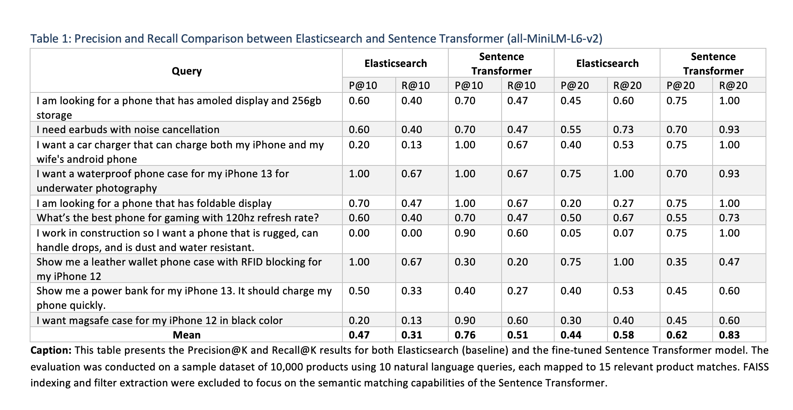
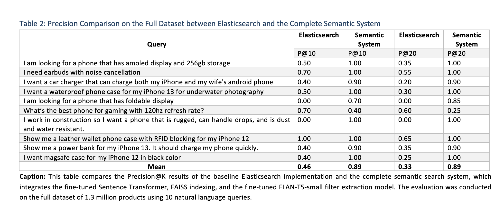
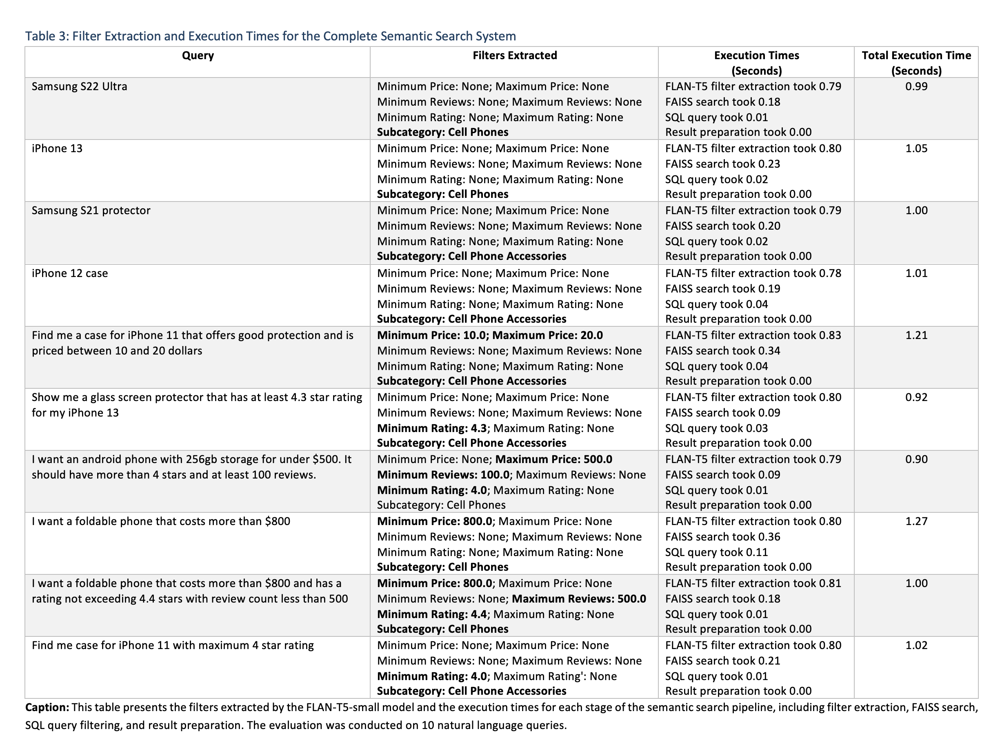

# Semantic-Search
This research focuses on the development of a high-efficiency semantic search system designed for an online retail catalog with millions of items. Using natural language processing and vector similarity search, the system enables users to input natural language queries and receive relevant product results from a large dataset of 1.3 million items in Cell Phones and Cell Phone Accessories category. We use Sentence Transformer for text embedding and Facebook AI Similarity Search (FAISS) for efficient indexing and search. The system is designed to handle product filters using Google FLAN-T5-small and generate highly relevant results while keeping computational costs low and focusing on scalability for large datasets.

This is a work-in-progress research paper.

## Fine-Tuning Models

## Sentence Transformer (all-MiniLM-L6-v2)
The Sentence Transformer was fine-tuned on 6,503,847 query-product pairs to encode user queries and product metadata into a shared semantic space. This enables precise retrieval of relevant products using FAISS indexing.

## FLAN-T5-small
The FLAN-T5-small model was fine-tuned on 55,496 query-label pairs to extract structured filters (price, ratings, review counts, subcategory) from user queries. This ensures dynamic result refinement.

## Results
To evaluate performance, Precision@K and Recall@K were measured, and the results were compared against a keyword-based Elasticsearch implementation. Products were ranked using Elasticsearch's BM25 algorithm, which scored them based on relevance to the queries. For semantic search, cosine similarity was used to match query and product embeddings. Elasticsearch served as a robust baseline for keyword-based retrieval, allowing us to assess the improvements offered by our semantic search system.




**Summary of Results for Table 1:**
The Sentence Transformer outperforms Elasticsearch across all precision and recall metrics, demonstrating the model's superior semantic understanding. Key highlights:

- **Precision@10** improved from 0.47 (Elasticsearch) to 0.76 (Sentence Transformer).
- **Recall@10** improved from 0.31 to 0.51.
- **Precision@20** improved from 0.44 to 0.62.
- **Recall@20** improved from 0.58 to 0.83.

The Sentence Transformer excels at handling queries requiring semantic understanding and conversational contexts, while Elasticsearch performs well for straightforward keyword-heavy queries.



**Summary of Results for Table 2:**
The complete semantic system (Sentence Transformer + FAISS + FLAN-T5-small) significantly outperforms Elasticsearch in Precision@K metrics for the full dataset:

- **Precision@10:** Semantic system achieves 0.89 compared to 0.46 for Elasticsearch.
- **Precision@20:** Semantic system achieves 0.89 compared to 0.33 for Elasticsearch.

The semantic system shows exceptional performance in retrieving relevant results for semantic and natural language queries, maintaining parity even for keyword-heavy queries. However, limitations were observed for specific numeric constraints (e.g., 120Hz refresh rate) and fine-grained distinctions (e.g., "Samsung S22 Ultra with 256GB storage"), highlighting areas for future improvement.



**Summary of Results for Table 3:**

**Filter Extraction Accuracy:**
- The FLAN-T5-small model performs well for most queries, accurately extracting filters like price ranges, ratings, and subcategories.
- Errors occur in edge cases, such as misinterpreting constraints (e.g., maximum vs. minimum ratings), due to limited representation of these cases in the fine-tuning dataset. Targeted dataset curation can address these issues.

**Execution Time Performance:**
- The system achieves execution times between 0.90 to 1.27 seconds, even on a CPU (M1 MacBook Air with 8GB RAM), showcasing its efficiency. Significant performance gains can be expected when deployed on GPU-enabled infrastructure.
- The filter extraction step is the most time-consuming, followed by FAISS search. Optimization could improve execution times for these steps.


## How to Replicate the Sample Evaluation Results

### 1. Clone the Repository
First, clone the repository to your local machine:

```bash
git clone https://github.com/emadsidd/Semantic-Search.git
cd Semantic-Search
```

### 2. Create a Virtual Environment
Set up a Python virtual environment to isolate dependencies:

```bash
# Create a virtual environment
python -m venv venv

# Activate the virtual environment
# On Linux/macOS:
source venv/bin/activate

# On Windows:
venv\Scripts\activate
```

### 3. Install Dependencies
Install the required Python libraries using the `requirements.txt` file:

```bash
pip install -r requirements.txt
```

### 4. Run the Evaluation Script
To replicate the sample results, execute the `evaluate_sample_dataset.py` script:

```bash
python evaluate_sample_dataset.py
```

## How to Run the Semantic Search System:
After steps 1 to 3 from above:

### 4. Download and Merge the Models Folder
Download the zip file containing the fine-tuned models and FAISS index from the link: https://1drv.ms/u/s!AqfmYowASmFYntJEvZx9qH0Kd7wwSA?e=OMVqtx

Extract the `models` folder and merge it with the `models` folder in the cloned repository.

### 5. Run the Semantic Search Model
To run the semantic search model, execute the `semantic_search.py` script:

```bash
python semantic_search.py
```

## Setting Up the Database Using the Dump File

To set up the database using the PostgreSQL dump file, follow these steps:

### For macOS/Linux:

### Install PostgreSQL:
If PostgreSQL is not already installed on your system, download and install it from the official PostgreSQL website: https://www.postgresql.org/download/

### 2. Start PostgreSQL Service:
Make sure the PostgreSQL service is running:

```bash
# macOS/Linux:
sudo service postgresql start
```

### 3. Download the Dump File:
Obtain the database dump file from the this link: https://1drv.ms/f/s!AqfmYowASmFYns1DYjtGqYUl9OOoQw?e=ZvHqxw


### 4. Create a New Database:
Log in to your PostgreSQL server and create a new database to import the dump file:

```bash
psql -U <username>
CREATE DATABASE <database_name>;
\q
```
Replace `<username>` with your PostgreSQL username and `<database_name>` with the desired name of your database.

### 5. Import the Dump File:
Use the following command to import the dump file into the newly created database:

```bash
pg_restore -U <username> -d <database_name> <path_to_dump_file>
```
Replace `<username>` with your PostgreSQL username, `<database_name>` with the name of the database you just created, and `<path_to_dump_file>` with the path to the downloaded dump file.


### For Windows:

### 1. Install PostgreSQL:
Download and install PostgreSQL from the official website: https://www.postgresql.org/download/

### 2. Start PostgreSQL Service:
Ensure the PostgreSQL service is running. You can check and start the service using the Services application (`services.msc`).

### 3. Download the Dump File:
Obtain the database dump file from the link provided.

### 4. Add PostgreSQL bin Directory to System's PATH (if required):
If PostgreSQL tools are not recognized when running commands, you may need to add the PostgreSQL bin directory to your system's PATH environment variable.
For detailed instructions on how to update the PATH environment variable, follow this guide: https://sqlbackupandftp.com/blog/setting-windows-path-for-postgres-tools/

### 5. Create a New Database:
Open the PostgreSQL interactive terminal by running the psql command and set up a new database:

```bash
CREATE DATABASE <database_name>;
\q
```
Replace `<database_name>` with the desired name of your database.

### 6. Import the Dump File:
Use the following command in the Command Prompt or PowerShell to import the dump file:

```bash
pg_restore -U <username> -d <database_name> "<path_to_dump_file>"
```
Replace `<username>` with your PostgreSQL username, `<database_name>` with the name of the database you just created, and `<path_to_dump_file>` with the path to the downloaded dump file.

### Notes on Configuration:

- If you use the default `postgres` username, set the password to `postgres` and database name to `mydb`, and the default port is `5432`, you will not need to make any changes to the Flask script.
- If your setup differs, you will need to update the connection details in the Flask app accordingly.
- In future updates, we will provide a Docker container based solution that will simplify the whole process of running the system on a local computer.


## Contribution
Emad Ahmed Siddiqui and Venkatesh Terikuti contributed to the development of the semantic search system, while Lakshmi Neharika Anchula and Harshit Mehta focused on implementing and evaluating Elasticsearch, as well as curating sample dataset for testing precision and recall.

## Acknowledgements
We deeply appreciate the ongoing support of our mentor, Dr. Xuan Lu, whose guidance and access to HPC were instrumental in making this work possible. 


