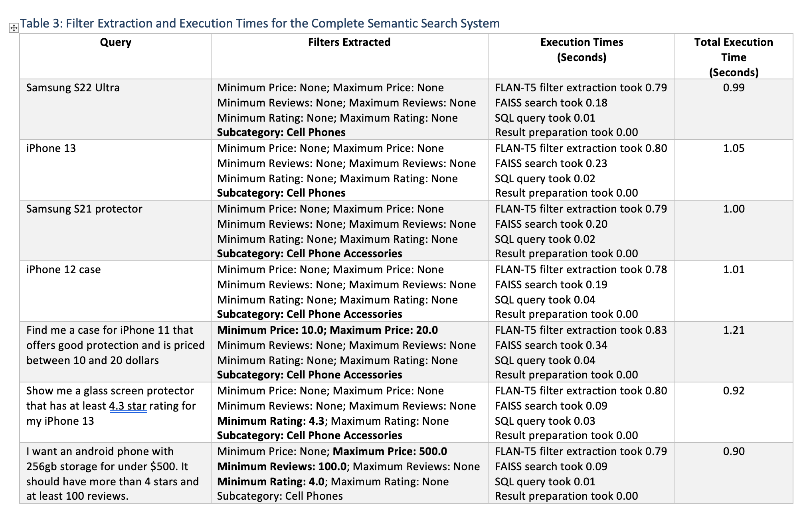
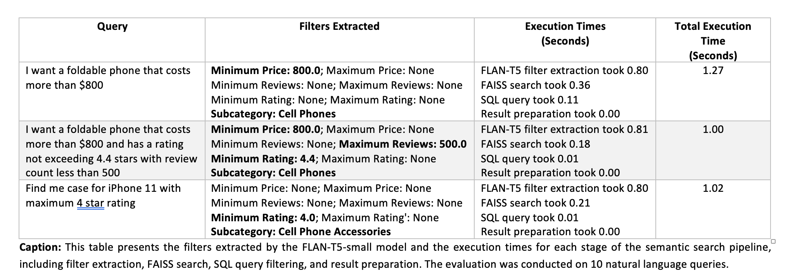

# Semantic-Search
This research focuses on the development of a high-efficiency semantic search system designed for an online retail catalog with millions of items. Using natural language processing and vector similarity search, the system enables users to input natural language queries and receive relevant product results from a large dataset of 1.3 million items. We use Sentence Transformer for text embedding and Facebook AI Similarity Search (FAISS) for efficient indexing and search. The system is designed to handle product filters and generate highly relevant results while keeping computational costs low and focusing on scalability for large datasets.

This is a work-in-progress research paper.


**Summary of Results for Table 1:**
The Sentence Transformer outperforms Elasticsearch across all precision and recall metrics, demonstrating the model's superior semantic understanding. Key highlights:

- **Precision@10** improved from 0.47 (Elasticsearch) to 0.76 (Sentence Transformer).
- **Recall@10** improved from 0.31 to 0.51.
- **Precision@20** improved from 0.44 to 0.62.
- **Recall@20** improved from 0.58 to 0.83.

The Sentence Transformer excels at handling queries requiring semantic understanding and conversational contexts, while Elasticsearch performs well for straightforward keyword-heavy queries.


**Summary of Results for Table 2:**
The complete semantic system (Sentence Transformer + FAISS + FLAN-T5-small) significantly outperforms Elasticsearch in Precision@K metrics for the full dataset:

- **Precision@10:** Semantic system achieves 0.89 compared to 0.46 for Elasticsearch.
- **Precision@20:** Semantic system achieves 0.89 compared to 0.33 for Elasticsearch.

The semantic system shows exceptional performance in retrieving relevant results for semantic and natural language queries, maintaining parity even for keyword-heavy queries. However, limitations were observed for specific numeric constraints (e.g., 120Hz refresh rate) and fine-grained distinctions (e.g., "Samsung S22 Ultra with 256GB storage"), highlighting areas for future improvement.





**Summary of Results for Table 3:**

**Filter Extraction Accuracy:**
- The FLAN-T5-small model performs well for general queries, accurately extracting filters like price ranges, ratings, and subcategories.
- Errors occur in edge cases, such as misinterpreting constraints (e.g., maximum vs. minimum ratings), due to limited representation of these cases in the fine-tuning dataset. Targeted dataset curation could address these issues.

**Execution Time Performance:**
- The system achieves execution times between 0.90 to 1.27 seconds, even on a CPU (M1 MacBook Air with 8GB RAM), showcasing its efficiency.
- The filter extraction step is the most time-consuming, followed by FAISS search. Deployment on GPU-enabled infrastructure could further improve performance, making the system scalable for larger datasets and real-time use cases.


# How to Replicate the Sample Evaluation Results

## 1. Clone the Repository
First, clone the repository to your local machine:

```bash
git clone https://github.com/username/repository-name.git
cd Semantic-Search
```

## 2. Create a Virtual Environment
Set up a Python virtual environment to isolate dependencies:

```bash
# Create a virtual environment
python -m venv venv

# Activate the virtual environment
# On Linux/macOS:
source venv/bin/activate

# On Windows:
venv\Scripts\activate
```

## 3. Install Dependencies
Install the required Python libraries using the `requirements.txt` file:

```bash
pip install -r requirements.txt
```

## 4. Run the Evaluation Script
To replicate the sample results, execute the `evaluate_sample_dataset.py` script:

```bash
python evaluate_sample_dataset.py
```
